# ObligaX

**Institutional Clearing, Bilateral Netting & Settlement Operations Platform**

Built on Canton/DAML 2.10 · PostgreSQL 16 · Express/TypeScript · Native ES Modules

---

[](https://github.com/MrDecryptDecipher/ObligaX)
[](https://www.typescriptlang.org/)
[](https://docs.daml.com/)
[](https://docs.daml.com/canton/)
[](LICENSE)

---

## What Is ObligaX?

ObligaX is an **institutional financial operations platform** designed for clearing houses, bilateral netting agents, treasury operations, and settlement infrastructure teams. It is **not** a generic admin dashboard, analytics tool, or portfolio project.

ObligaX manages the complete lifecycle of bilateral financial obligations — from initial proposal through acceptance, confirmation, multilateral netting compression, payment rail settlement, cryptographic audit chaining, and real-time ACS reconciliation — all enforced on-ledger by DAML smart contracts running on the Canton distributed ledger.

### Core Domain

| Domain | Responsibility |
|--------|----------------|
| **Obligation Management** | Propose, accept, confirm, amend, and dispute bilateral payment obligations |
| **Bilateral Netting** | Atomically compress multilateral confirmed obligations into single net instructions |
| **Settlement Gateway** | Dispatch net settlement instructions to external payment rails (RTGS, dvP adapters) |
| **ACS Reconciliation** | Two-way integrity verification between Canton Active Contract Set and PostgreSQL projections |
| **Cryptographic Audit** | SHA-256 hash-chained immutable audit ledger with mathematical chain verification |
| **Governance** | Policy-as-code enforcement for exposure limits, netting rules, and participant authorizations |

---

## Architecture

### System Overview

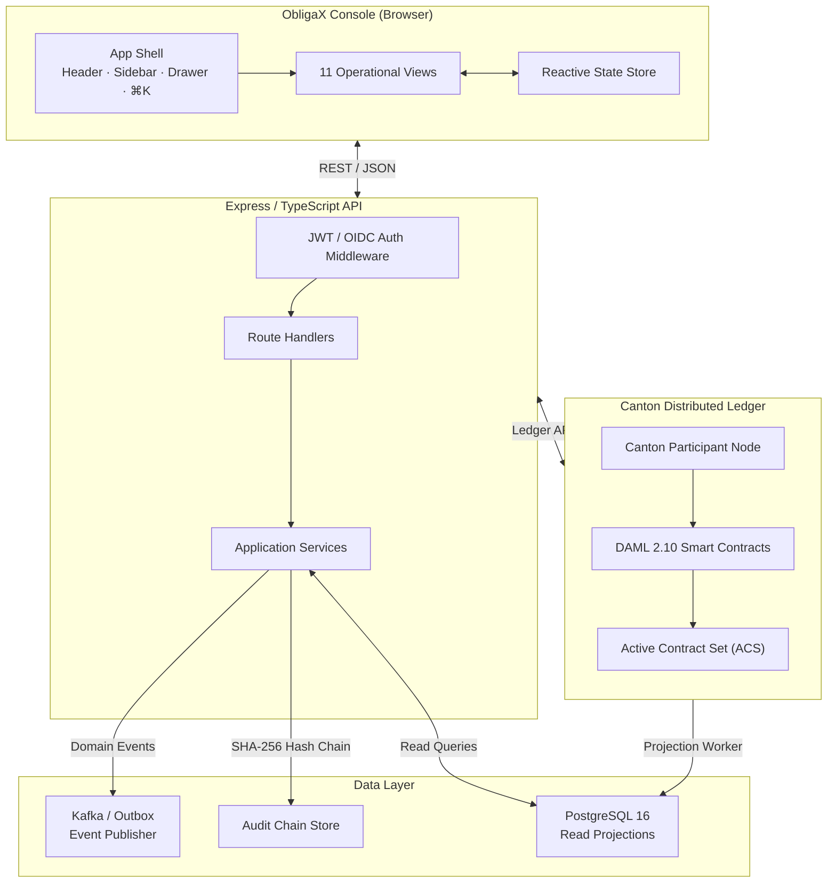

### Obligation Lifecycle

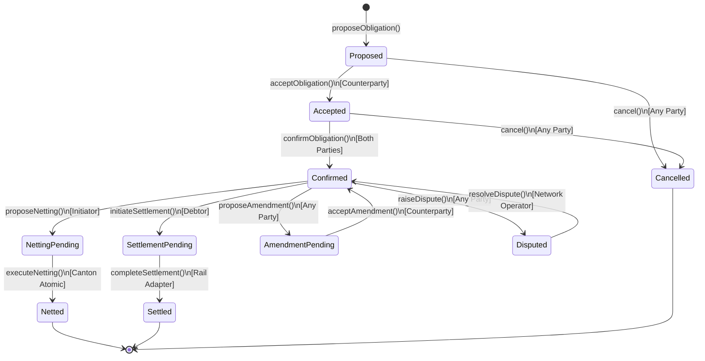

### Netting & Settlement Flow

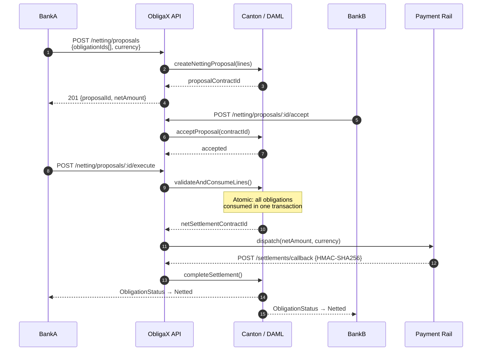

### ACS Reconciliation

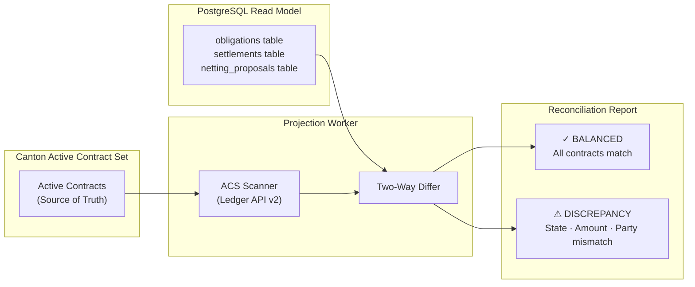

### Cryptographic Audit Chain

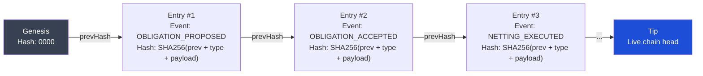

---

## Domain Model

### Core Entities

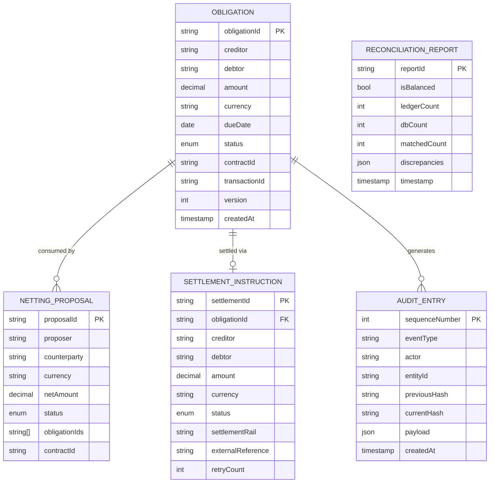

---

## Application Shell

ObligaX ships with an 11-screen institutional operations console built entirely in native ES modules — no bundler, no framework, no build step.

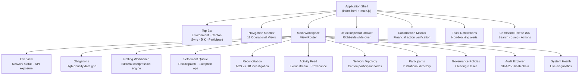

---

## Project Structure

```
ObligaX/
├── backend/                         # Express / TypeScript API server
│   ├── src/
│   │   ├── api/
│   │   │   ├── controllers/         # HTTP route handlers
│   │   │   ├── middleware/          # Auth, validation, rate-limit, CORS
│   │   │   └── routes/              # Express router definitions
│   │   ├── application/             # Domain application services
│   │   │   ├── governance/          # Participant registry, policy engine
│   │   │   ├── netting/             # Netting proposal lifecycle
│   │   │   ├── obligation/          # Obligation state machine
│   │   │   └── settlement/          # Settlement rail adapter
│   │   ├── domain/                  # Core domain models & invariants
│   │   ├── infrastructure/
│   │   │   ├── canton/              # Ledger API v2 client
│   │   │   ├── database/            # PostgreSQL repositories
│   │   │   └── kafka/               # Event outbox publisher
│   │   └── utils/                   # SafeDecimal, hash chain, logger
│   └── tests/
│       ├── unit/                    # 54 deterministic unit tests
│       └── integration/             # Canton ledger integration tests
│
├── frontend/                        # Institutional operations console
│   ├── index.html                   # Application shell (ES module entry)
│   ├── styles.css                   # Master stylesheet import
│   ├── styles/
│   │   ├── tokens.css               # Design system tokens
│   │   ├── base.css                 # Resets, tabular numerals
│   │   ├── shell.css                # Header, sidebar, workspace layout
│   │   ├── components.css           # Buttons, badges, drawers, modals
│   │   ├── data-grid.css            # High-density institutional data grid
│   │   ├── views.css                # View-specific layouts
│   │   └── responsive.css           # Breakpoints
│   └── src/
│       ├── main.js                  # Bootstrap, router, keyboard shortcuts
│       ├── state/
│       │   └── store.js             # Reactive pub/sub state store
│       ├── services/
│       │   └── api.js               # Centralized API client (trace IDs, anti-replay)
│       ├── components/
│       │   ├── header.js            # Top bar
│       │   ├── sidebar.js           # Navigation
│       │   ├── drawer.js            # Detail inspector
│       │   ├── confirmation-modal.js # Financial action modals
│       │   ├── command-palette.js   # ⌘K search
│       │   └── notifications.js     # Toast stack
│       ├── views/                   # 11 operational view modules
│       └── utils/
│           ├── dom.js               # XSS-safe DOM helpers
│           ├── formatters.js        # Currency, timestamp, hash formatters
│           └── icons.js             # Curated SVG institutional icon set
│
├── daml/                            # DAML 2.10 smart contract source
└── docker-compose.yml               # Canton + PostgreSQL + Kafka stack
```

---

## Design System

ObligaX uses a restrained institutional design language — precision financial infrastructure, not cyberpunk SaaS.

```mermaid
flowchart LR
    subgraph Tokens["Design Tokens"]
        direction TB
        Colors["Surface Palette\n--surface-canvas → elevated\nDeep graphite #0a0c0f → #1e2535"]
        Borders["Border Scale\nSubtle → Default → Strong"]
        Type["Typography\nInter UI + JetBrains Mono\nTabular numeric rendering"]
        States["Semantic States\nSuccess · Warning · Danger · Info · Neutral\nOnly used where state matters"]
        Space["Spacing Scale\n2px → 4 → 8 → 12 → 16 → 24 → 32"]
    end

    Tokens --> Components["Components"]
    Components --> Views["Views"]

    subgraph Components
        direction TB
        Grid["High-density Data Grid\nCompact · Comfortable density modes"]
        Drawer["Detail Drawer\nLevel 1 Business · Level 2 Canton Provenance"]
        Badges["Lifecycle Badges\nProposed · Accepted · Confirmed · Netted · Settled"]
        Modal["Financial Modals\nDouble-confirm destructive actions"]
    end
```

### Design Principles

| Principle | Implementation |
|-----------|---------------|
| **No fake states** | Every value comes from backend or is explicitly marked `Unknown / Not configured` |
| **No browser dialogs** | Zero `alert()` / `confirm()` / `prompt()` — all replaced by modal UI |
| **No inline styles** | All styles via design system tokens in CSS files |
| **No XSS vectors** | All DOM construction via `createElement()` — never `innerHTML` with data |
| **Tabular numerals** | `font-feature-settings: "tnum" 1` on all financial values |
| **Keyboard-first** | `⌘K` command palette, `Escape` to dismiss, arrow navigation |

---

## Security Architecture

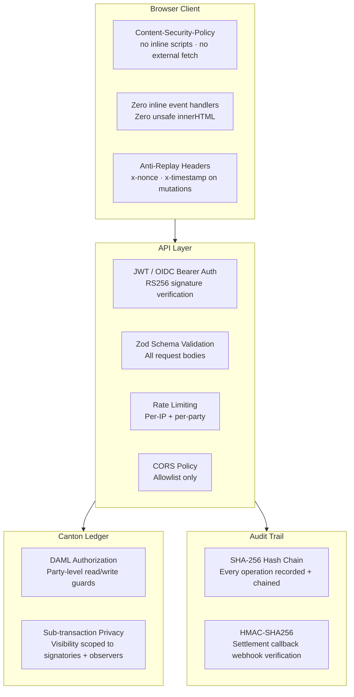

---

## Getting Started

### Prerequisites

| Component | Version |
|-----------|---------|
| Node.js | ≥ 20 LTS |
| DAML SDK | 2.10.x |
| Canton | 2.10.x |
| PostgreSQL | 16 |
| Docker | ≥ 24 (for full stack) |

### Quick Start (Local Development)

```bash
# 1. Clone the repository
git clone https://github.com/MrDecryptDecipher/ObligaX.git
cd ObligaX

# 2. Install backend dependencies
cd backend && npm install

# 3. Set environment variables
cp .env.example .env
# Edit .env with your PostgreSQL connection string and Canton API settings

# 4. Run database migrations
npm run migrate

# 5. Start the development server (serves both API + frontend)
npm run dev

# 6. Open the console
open http://localhost:3000
```

### Environment Variables

| Variable | Description | Default |
|----------|-------------|---------|
| `DATABASE_URL` | PostgreSQL connection string | `postgresql://localhost:5432/obligax` |
| `CANTON_LEDGER_API_HOST` | Canton Ledger API host | `localhost` |
| `CANTON_LEDGER_API_PORT` | Canton Ledger API port | `5011` |
| `CANTON_PARTY_ID` | Default operator party ID | `NetworkOperator` |
| `JWT_SECRET` | OIDC/JWT signing secret | Required |
| `SETTLEMENT_WEBHOOK_SECRET` | HMAC secret for rail callbacks | Required |
| `PORT` | Express server port | `3000` |

### Docker Compose (Full Stack)

```bash
# Spin up Canton + PostgreSQL + Kafka + ObligaX
docker-compose up -d

# View logs
docker-compose logs -f obligax-api
```

---

## API Reference

### Base URL

```
http://localhost:3000/api/v1
```

### Authentication

All requests require:
```
Authorization: Bearer <jwt_token>
x-party-id: <party_id>
```

Mutating requests (POST/PUT) also require anti-replay headers:
```
x-timestamp: <unix_ms>
x-nonce: <24_hex_chars>
```

### Key Endpoints

#### Obligations

| Method | Endpoint | Description |
|--------|----------|-------------|
| `GET` | `/obligations` | List obligations (filterable by status, party, currency) |
| `POST` | `/obligations` | Propose a new bilateral obligation |
| `GET` | `/obligations/:id` | Fetch obligation detail |
| `POST` | `/obligations/:id/accept` | Accept a proposed obligation |
| `POST` | `/obligations/:id/confirm` | Confirm an accepted obligation |
| `POST` | `/obligations/:id/cancel` | Cancel an obligation |
| `POST` | `/obligations/:id/disputes` | Raise a dispute |
| `POST` | `/obligations/:id/amendments` | Propose an amendment |

#### Netting

| Method | Endpoint | Description |
|--------|----------|-------------|
| `GET` | `/netting/proposals` | List netting proposals |
| `POST` | `/netting/proposals` | Create bilateral netting proposal |
| `POST` | `/netting/proposals/:id/accept` | Accept netting proposal |
| `POST` | `/netting/proposals/:id/reject` | Reject netting proposal |
| `POST` | `/netting/proposals/:id/execute` | Execute atomic netting (Canton transaction) |

#### Settlement

| Method | Endpoint | Description |
|--------|----------|-------------|
| `GET` | `/settlements` | List settlement instructions |
| `POST` | `/settlements` | Initiate direct settlement |
| `POST` | `/settlements/:id/process` | Dispatch to payment rail |
| `POST` | `/settlements/retry` | Retry failed settlement |
| `POST` | `/settlements/callback` | External rail callback (HMAC-authenticated) |

#### Governance & Audit

| Method | Endpoint | Description |
|--------|----------|-------------|
| `GET` | `/governance/participants` | List registered clearing participants |
| `GET` | `/governance/policy` | Retrieve active network policy |
| `GET` | `/governance/audit` | Query cryptographic audit log |
| `GET` | `/governance/audit/verify` | Verify SHA-256 chain integrity |

#### System

| Method | Endpoint | Description |
|--------|----------|-------------|
| `GET` | `/health` | System health (Canton, PostgreSQL, Kafka) |
| `POST` | `/reconciliation/run` | Execute ACS vs DB reconciliation |

---

## Testing

```bash
# Run all 54 deterministic unit tests
cd backend && npm test

# TypeScript compile check (zero errors)
npx tsc --noEmit

# Watch mode during development
npm run test:watch
```

### Test Coverage

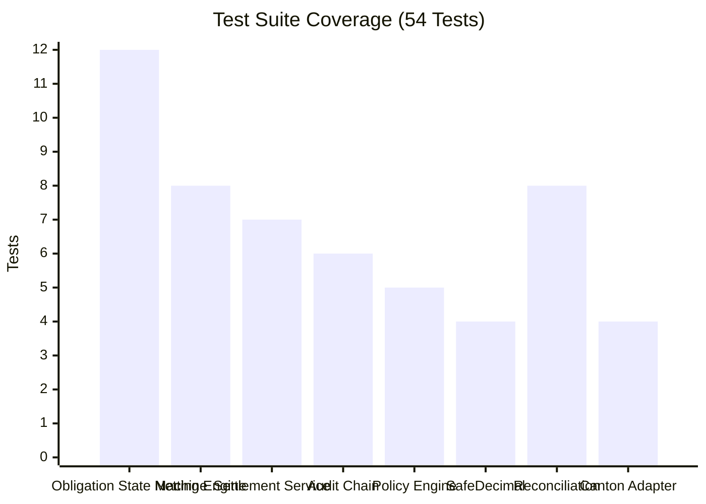

### Test Suites

| Suite | Tests | Description |
|-------|-------|-------------|
| Obligation State Machine | 12 | All lifecycle transitions, authorization guards, illegal skip rejection |
| Netting Engine | 8 | Bilateral pair matching, atomic compression, currency segregation |
| Settlement Service | 7 | Rail dispatch, callback HMAC verification, retry logic |
| Cryptographic Audit | 6 | Hash chain construction, genesis block, tampering detection |
| Policy Engine | 5 | Exposure limits, currency corridors, daily gross caps |
| SafeDecimal | 4 | IEEE-754 avoidance, institutional precision, division guards |
| Reconciliation | 8 | ACS drift detection, mismatch types, balanced state |
| Canton Adapter | 4 | Multi-participant topology, ACS projection, ledger API v2 |

---

## DAML Contracts

### Contract Hierarchy

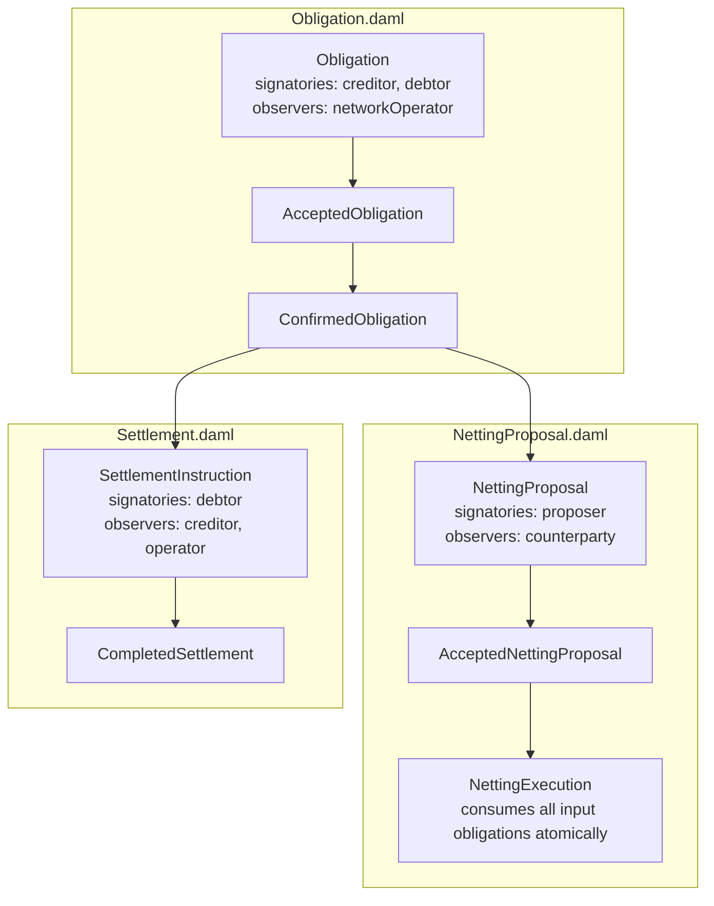

---

## Network Topology

ObligaX operates with a multi-participant Canton topology:

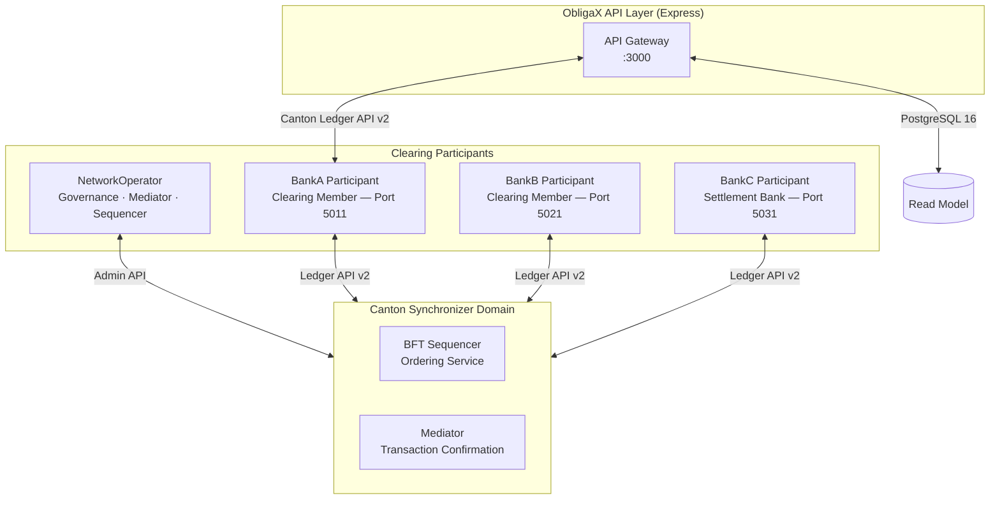

---

## Governance Policy (Default)

| Policy | Value |
|--------|-------|
| Maximum single obligation amount | USD 100,000,000 |
| Default daily gross exposure ceiling | USD 50,000,000 |
| Settlement bank daily limit | USD 100,000,000 |
| Minimum netting compression lines | 2 obligations |
| Netting cutoff window | 16:00 UTC daily |
| Netting proposal expiry | 24 hours |
| Dispute response SLA | 4 business hours |
| Supported clearing currencies | USD, EUR, GBP, SGD |
| Maximum settlement retry attempts | 3 |
| Adapter timeout threshold | 30,000 ms |
| Delivery mode | dvP (Delivery vs Payment) |

---

## What This Is Not

ObligaX deliberately avoids the following patterns:

- ❌ Generic admin dashboard UI
- ❌ Hardcoded fake network states (`"CONNECTED"`, `"MAINNET"`, `"FEDWIRE ENABLED"`)
- ❌ Browser `alert()` / `confirm()` / `prompt()`
- ❌ Inline styles or inline event handlers
- ❌ Client-side floating-point arithmetic for financial values
- ❌ `innerHTML` string interpolation (XSS vector)
- ❌ Mock/simulated operational state presented as real
- ❌ AI-generated cyberpunk / glassmorphism / gradient dashboard aesthetics
- ❌ Fake Canton contract IDs or fabricated transaction hashes

---

## Contributing

1. Fork and create a feature branch: `git checkout -b feat/your-feature`
2. Ensure 54/54 tests pass: `npm test`
3. Ensure TypeScript compiles: `npx tsc --noEmit`
4. Submit a pull request with a clear description of the domain change

---

## License

Apache License 2.0 — see [LICENSE](LICENSE) for details.

---

*ObligaX is a demonstration of institutional-grade financial infrastructure engineering on the Canton/DAML stack. It is not production-certified financial software.*
