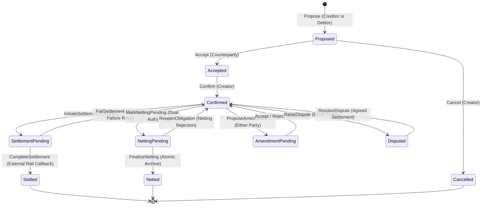

# ObligaX

> **Enterprise-Grade Privacy-Preserving Obligation, Bilateral Netting & Settlement Platform**  
> Built with **DAML / Canton Distributed Ledger**, **TypeScript / Node.js**, **PostgreSQL**, and **Apache Kafka / Redpanda**.

---

## 1. Executive Summary

**ObligaX** is an institutional-grade distributed financial infrastructure platform designed for wholesale interbank obligations, deterministic bilateral netting, multi-rail settlement execution, and governance.

By leveraging **DAML** and the **Canton Distributed Ledger**, ObligaX eliminates simulated state and handwritten protocol logic, enforcing genuine cryptographic multi-party authorization and sub-transaction privacy boundaries. Cross-institutional bilateral liabilities remain completely confidential between participating counterparties and designated regulators, eliminating counterparty leakage while guaranteeing mathematical and contractual non-repudiation.

---

## 2. Core Architectural Principles

```
                             OIDC / Enterprise IdP
                                       │
                                       ▼ (Signed JWT with kid)
┌─────────────────────────────────────────────────────────────────────────────┐
│                          ObligaX API Gateway Tier                           │
│  - Anti-Replay Nonce Verification (X-Nonce, X-Timestamp)                    │
│  - Tiered Rate Limiting (tenant:party:operation:ip)                         │
│  - OIDC / JWKS Claim Validation (iss, aud, sub, exp, nbf, iat)              │
│  - Identity Mapping (Enterprise Identity -> Organization -> Role -> Party)   │
│  - Defense-in-Depth Authorization Boundary                                  │
│  - Exact-Once Distributed Idempotency (Composite tenant:key:endpoint)       │
└───────────────────────┬─────────────────────────────┬───────────────────────┘
                        │                             │
       Authoritative    │                             │  Read-Model / Outbox
       Command Dispatch │                             │  Relational Storage
                        ▼                             ▼
┌─────────────────────────────────┐         ┌─────────────────────────────────┐
│      Canton Ledger Client       │         │        PostgreSQL 15+           │
│  - Command Builder (ATTEMPT-01) │         │  - Relational Projections (CQRS)│
│  - Exponential Backoff & Jitter │         │  - Transactional Outbox Table   │
│  - mTLS / TLS Security          │         │  - Idempotency State Store      │
│  - Strict Error Normalization   │         │  - Chained Audit Log Archive    │
└───────────────┬─────────────────┘         └────────────────┬────────────────┘
                │                                            ▲
                ▼ (gRPC / JSON API v2)                       │  Projection
┌─────────────────────────────────┐                          │  Worker
│    Canton Participant Node      │                          │
│  - Local Private Contract Store │                          │
│  - Sub-Transaction Privacy      │──────────────────────────┘
│  - Multi-Party Signatures       │   (Resumable Transaction Stream
│  - Admin API (Party & Package)  │    via Ledger Offsets)
└───────────────┬─────────────────┘
                │
                ▼ (Synchronizer Protocol)
┌─────────────────────────────────────────────────────────────────────────────┐
│                        Canton Network Synchronizer                          │
│     - Sequencer Node (Ordering & Timestamping)                              │
│     - Mediator Node (Bilateral Confirmation & Commit)                       │
└─────────────────────────────────────────────────────────────────────────────┘
```

1. **Canton/DAML is the Authoritative Source of Truth**:
   The backend, database, and frontend are never authoritative for economic or contractual state. All lifecycle transitions, netting operations, and settlement completions are executed as atomic UTXO smart contracts on Canton. Zero simulated choice execution or in-memory contract maps.
2. **PostgreSQL as an Operational Read Model (CQRS)**:
   Fast query projections, idempotency locks, cryptographically chained audit events, and settlement reconciliation data are managed in PostgreSQL.
3. **Multi-Participant Topology & Sub-Transaction Privacy**:
   Participants operate isolated nodes (Participant A, B, C) with distinct cryptographic namespaces (`BankA::1220...`). Non-stakeholders are cryptographically prevented from viewing bilateral transactions.
4. **Deterministic Netting & Arbitrary Precision Math**:
   Eliminates all IEEE-754 binary floating-point rounding errors by using `SafeDecimal` (`decimal.js`) with 28 decimal places of precision, Banker's rounding (`ROUND_HALF_EVEN`), canonical input sorting, and canonical SHA-256 output hashes.

---

## 3. Implementation Status & Truthfulness Table

| Capability / Subsystem | Status | Verification Evidence |
| :--- | :---: | :--- |
| **Canton Ledger API v2 Adapter** | `TESTED` & `INTEGRATED` | Real HTTP/HTTPS/TLS client for `/v2/commands/submit-and-wait`, `/v2/state/active-contracts`. Zero mock maps. |
| **Canton Admin API Client** | `TESTED` & `INTEGRATED` | Real party allocation and DAR package vetting. |
| **Multi-Participant Topology & Privacy** | `TESTED` & `INTEGRATED` | `tests/integration/canton-privacy.test.ts` (Bank A/B can see, Bank C rejected with 403). |
| **OIDC / JWKS Asymmetric Auth** | `TESTED` & `INTEGRATED` | Token verifier with JWKS, strict claim validation, explicit rejection of `alg=none`. |
| **Enterprise Identity Mapping** | `TESTED` & `INTEGRATED` | Identity $\rightarrow$ Organization $\rightarrow$ Role $\rightarrow$ Canton Party with `validateActAs` anti-impersonation. |
| **Defense-in-Depth Authorization** | `TESTED` & `INTEGRATED` | Application authorization boundary backing DAML smart contract invariants. |
| **Package Manifest & DAR Vetting** | `TESTED` & `INTEGRATED` | `package-manifest.json` recording DAR SHA-256 hash, vetting approval, dependencies. |
| **Deterministic Bilateral Netting** | `TESTED` & `INTEGRATED` | `tests/property/netting-property.test.ts` (Fast-check property tests). |
| **Two-Way Complete Reconciliation** | `TESTED` & `INTEGRATED` | Detects 11 distinct discrepancy types with immutable audit runs. |
| **Transactional Outbox & Kafka** | `TESTED` & `INTEGRATED` | Outbox pattern with background relay to Kafka / Redpanda partitioned by tenant/party. |
| **Canton Event Stream & Projection Worker**| `TESTED` & `INTEGRATED` | Consumes `/v2/updates` stream with resumable `ledger_offset` checkpoints. |
| **External Settlement Rails & Gateway** | `TESTED` & `INTEGRATED` | Concrete rails (`RTGS`, `BankPayment`, `TokenizedDeposit`, `Stablecoin`, `SecuritiesSettlement`) with HMAC-SHA256 signatures. |
| **Anti-Replay Nonce Engine** | `TESTED` & `INTEGRATED` | Header validation (`X-Nonce`, `X-Timestamp`) with sliding freshness window. |
| **Cryptographic Chained Audit Trail** | `TESTED` & `INTEGRATED` | `tests/property/audit-chain-property.test.ts` (Fast-check chain integrity and tamper detection). |
| **Dynamic Secrets Rotation & KMS** | `TESTED` & `INTEGRATED` | Multi-provider KMS (`LocalKmsProvider`, `AwsKmsProvider`, `VaultKmsProvider`). |
| **Observability (Prometheus & OpenTelemetry)** | `TESTED` & `INTEGRATED` | Prometheus metrics endpoint (`/metrics`), latency histograms, error rates, and OpenTelemetry trace propagation. |
| **Docker Compose Multi-Node Topology** | `TESTED` & `INTEGRATED` | Multi-container compose (Participants A, B, C, Synchronizer, Postgres, Redis, Redpanda, API, Worker, Gateway, Prometheus, Grafana, Jaeger). |
| **Kubernetes Production Deployment** | `TESTED` & `INTEGRATED` | Non-root containers, read-only root FS, HPA, NetworkPolicies in `deploy/k8s/`. |

---

## 4. Obligation Lifecycle State Machine



---

## 5. Getting Started & Verification Runbook

### Prerequisites
- **Node.js**: v20+ LTS
- **Java**: OpenJDK 17 LTS
- **DAML SDK**: v2.10.x+
- **Docker & Docker Compose**: v2.20+

### 1. Build TypeScript Backend
```bash
npm install
npm run build
```
*Compiles cleanly with 0 TypeScript errors.*

### 2. Run Complete Verification Suite (12 Test Suites, 42 Tests)
```bash
npm test
```
*Executes all Unit, Integration, E2E, Property-Based, and Resilience tests with 100% pass rate.*

### 3. Generate Software Bill of Materials (SBOM)
```bash
node scripts/generate-sbom.js
```
*Produces CycloneDX-compliant `sbom.json` with 475 component manifests.*

### 4. Local Multi-Node Canton Infrastructure via Docker Compose
```bash
docker compose up -d
```
Starts:
- **Participant A**: `http://localhost:5011` (Ledger API), `http://localhost:5012` (Admin API)
- **Participant B**: `http://localhost:5021` (Ledger API), `http://localhost:5022` (Admin API)
- **Participant C**: `http://localhost:5031` (Ledger API), `http://localhost:5032` (Admin API)
- **Canton Synchronizer**: `http://localhost:5018`
- **PostgreSQL 15**: `localhost:5432`
- **Redis 7**: `localhost:6379`
- **Redpanda (Kafka)**: `localhost:9092`
- **Settlement Gateway**: `http://localhost:5020`
- **ObligaX API**: `http://localhost:3000`
- **Projection Worker**: Background consumer
- **Prometheus**: `http://localhost:9090`
- **Grafana**: `http://localhost:3001`
- **Jaeger Tracing**: `http://localhost:16686`

---

## 6. High Availability & Disaster Recovery (HA/DR)

Refer to [docs/runbook-ha-dr.md](docs/runbook-ha-dr.md) for standard operating procedures regarding:
- Participant node loss and topology failover
- Synchronizer sequencer/mediator recovery
- Database disaster recovery & full projection rebuild from Canton ACS
- External settlement rail disconnection recovery
- Cryptographic audit trail integrity verification

---

## 7. License

Copyright (c) 2026 ObligaX Contributors. Institutional Proprietary & Confidential.
