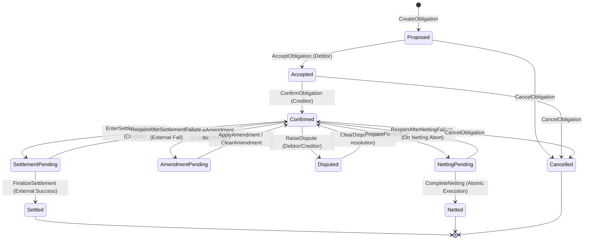

# ObligaX Domain Model & Lifecycle Specifications

## 1. Core Economic Concept: The Obligation

An **Obligation** represents a legally binding, contractual financial debt owed by one institutional participant (the `debtor`) to another institutional participant (the `creditor`).

### Key Attributes:
- `obligationId`: External business identifier (unique across participant systems).
- `creditor`: Canton party holding the receivable (payee).
- `debtor`: Canton party holding the payable (payer).
- `amount`: Financial amount modeled with 10-decimal SafeDecimal precision (`Decimal(28, 10)`).
- `currency`: Supported ISO currency code (`USD`, `EUR`, `GBP`, `INR`, `JPY`, `CHF`, `SGD`, `AUD`, `CAD`).
- `status`: Lifecycle state.
- `createdDate`: Accounting creation date (`YYYY-MM-DD`).
- `dueDate`: Contractual maturity date ($\ge \text{createdDate}$).
- `priority`: Execution priority (`Low`, `Normal`, `High`, `Urgent`).
- `version`: Monotonically increasing contract revision integer ($\ge 1$).
- `metadata`: Provenance tracking (`sourceSystem`, `sourceReference`, `businessUnit`, `createdBy`, `createdAt`).

---

## 2. Obligation Lifecycle State Transitions

> **CRITICAL ARCHITECTURAL DISTINCTION**:
> `NettingPending` and `SettlementPending` represent distinct economic workflows and MUST NOT be collapsed.
> - `Confirmed` $\rightarrow$ `SettlementPending` $\rightarrow$ `Settled`
> - `Confirmed` $\rightarrow$ `NettingPending` $\rightarrow$ `Netted`

---

## 3. Bilateral Netting Specification

### 3.1 Eligibility Invariants
1. `initiator` $\ne$ `counterparty`.
2. Every participating obligation in `lines` must be in `Confirmed` state.
3. Every obligation currency must equal the agreed netting currency.
4. For every obligation $i \in \text{lines}$:
   - $(\text{creditor}_i = \text{initiator} \land \text{debtor}_i = \text{counterparty}) \lor (\text{debtor}_i = \text{initiator} \land \text{creditor}_i = \text{counterparty})$.
5. The net amount must be strictly greater than zero ($\text{netAmount} > 0$).

### 3.2 Calculation Mechanics
$$\text{Gross Receivable} = \sum_{\substack{i \in \text{lines} \\ \text{creditor}_i = \text{initiator}}} \text{amount}_i$$
$$\text{Gross Payable} = \sum_{\substack{i \in \text{lines} \\ \text{debtor}_i = \text{initiator}}} \text{amount}_i$$
$$\text{Net Amount} = |\text{Gross Receivable} - \text{Gross Payable}|$$

$$\text{Direction} = \begin{cases} 
\text{CounterpartyPays}, & \text{if } \text{Gross Receivable} \ge \text{Gross Payable} \\ 
\text{InitiatorPays}, & \text{if } \text{Gross Receivable} < \text{Gross Payable} 
\end{cases}$$

### 3.3 Atomic Execution & Rollback
In DAML, the recursive choice `validateAndConsumeLines` executes in a single transaction. If any obligation in the proposed batch fails state validation, authorization, or currency checks, Canton aborts the transaction in its entirety. **No partial netting is ever committed.**

---

## 4. Settlement Failure and Recovery Workflow

External banking networks (RTGS, Fedwire, SWIFT) are asynchronous and subject to execution errors (insufficient liquidity, operational timeouts, cut-off windows).

1. **Initiation**: `SettlementInstruction` is created with status `SettlementCreated`, locking the underlying obligation into `SettlementPending`.
2. **Processing**: Status advances to `SettlementProcessing` while the payment instruction is dispatched to the rail.
3. **Execution Success**:
   - `CompleteSettlement` consumes the instruction, setting status to `SettlementCompleted`.
   - Atomically invokes `FinalizeSettlement` on the obligation contract, transitioning it to `Settled`.
4. **Execution Failure**:
   - `FailSettlement` consumes the instruction, setting status to `SettlementFailed` with forensic error metadata.
   - Atomically invokes `ReopenAfterSettlementFailure` on the obligation contract, returning it to `Confirmed`.
5. **Retry**:
   - `RetrySettlement` consumes the failed instruction, locks the reopened obligation back into `SettlementPending`, and creates a new instruction with an incremented `retryCount`.
